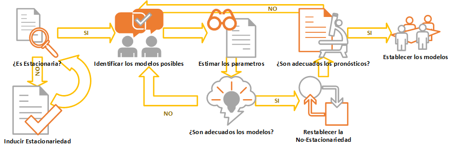
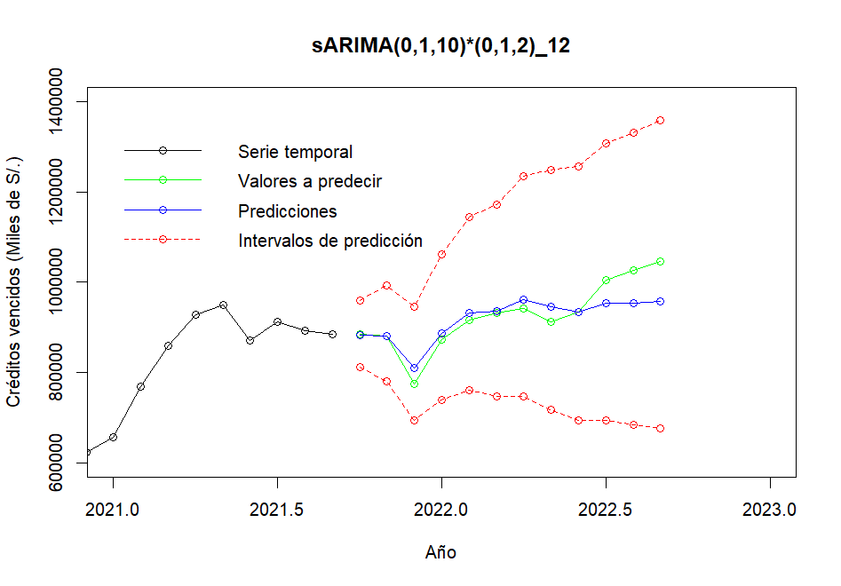

```{r setup, include=FALSE}
knitr::opts_chunk$set(echo = FALSE)
```

# Resumen

El propósito del siguiente póster es dar a conocer los resultados de la evaluacion y `pronóstico` de una `serie temporal` en la que se recopilo informacion de la SBS: `Créditos vencidos` para los análisis respectivos. aplicandose dos modelos predictivos: `Suavizamiento exponencial de Holt` y la `Metodologia de Box Jenkins`, determinandose que este último es el modelo mas adecuado para realizar los pronosticos de nuestra serie temporal.

***Palabras Clave:*** *Pronóstico*, *Serie Temporal*, *Créditos vencidos*, *Suavizamiento exponencial de Holt*, *Metodologia de Box Jenkins*.

# Introducción

En la última década se ha hecho evidente la participación activa de las entidades financieras, mas aún en la época actual de `reactivación económica` del pais, tales como son las cajas municipales. La situación de los creditos otorgados a los clientes es una problemática mas recurrente que tienen dichas entidades, debido a que tienen que afrontar el riesgo de los `créditos vencidos` que cada vez tienen un mayor impacto. 

Se plantearon los siguientes objetivos: Evaluar modelos de series temporales que nos permitan pronosticar los `créditos vencidos` y determinar el modelo de series temporales de mayor precisión. [@R-posterdown].

# Metodología

Se ha utilizado una base de datos que fue obtenida de la base de datos de la SBS, el cual cuenta con 261 datos recopilados mensualmente en el periodo 01/2001 a 09/2022, en los que se tienen la estimacion total de los créditos vencidos que ocurren en las cajas municipales de todo el Peru en dicho periodo de tiempo.

Es por ello que para identificar un modelo adecuado se ha establecido seguir un flujo de modelamiento (***Fig.1***) para nuestra serie temporal

**Figura 1:** *Pasos del Modelamiento*

{width="100%"}

# Resultados

En el `entendimiento de la data` se realizo un análisis exploratorio en los que se pudo identificar que nuestra serie `creditos_vencidos.ts` solo presenta tendencia (***Fig. 2***), luego se procedio a dividir nuestra data en: entrenamiento y prueba, estableciendose prueba a los ultimos 12 meses de la serie; dado esto se procedió a aplicar el `Suavizado Exponencial de Holt` para ajustar eficazmente el modelo a dicha tendencia en los datos.

**Figura 2:** *Serie temporal: Créditos Vencidos*

```{r,warning=FALSE,message=FALSE,out.width="95%",fig.align='center'}
library(fpp2)
library(tseries)
library(magrittr)
creditos_vencidos <- scan("creditos_vencidos-cajas.txt")
creditos_vencidos.ts <- ts(creditos_vencidos, start=c(2001, 1), frequency=12)
cred<-decompose(creditos_vencidos.ts)
autoplot(creditos_vencidos.ts, series="Crédito vencido") + 
    autolayer(trendcycle(cred), series="Tendencia") +
    labs(title = "Creditos Vencidos (2001-2022)",      
       x = "Tiempo",
       y = "Miles de soles S/."
       ) + 
    theme_bw()
```

**Suavizamiento exponencial de Holt**

Escribe aqui, puedes colocar algunas metricas y resultados

**Metodología Box Jenkins**

**Figura 3:** *Pasos de la metodología Box Jenkins*
{width="100%"}
Para cumplir las condiciones necesarias, se evaluó si nuestra serie era estacionaria, obteniendose un p_value=0.4062, que nos indica que no es estacionaria, por ende se procedio a inducirla, en vista a que nuestra varianza no era homogenea, se utilizo la transformacion de BOX COX con un parámetro $\lambda=0$, obteniendose una varianza homogenea para nuestra serie. 

La serie presentaba tendencia, por lo que se le ha aplicado la diferenciación regular con parametro $d=1$ pudiendo estabilizarla.

Finalmente se identificó que la serie presentaba estacionalidad, por lo que se procedio a aplicar una diferenciación estacional, con una ciclicidad anual.

Dado esto, se ha evaluado que la serie ya era estacionaria, obteniendose un $p-value=0.01$.

Con las transformaciones y diferenciaciones que fueron aplicadas, se han planteado modelos tentativos, de los cuales se obtuvo que el modelo que mejor se ajusta a nuestra serie es:

***Modelo: $sARIMA(0,1,10)*(0,1,2)_{12}$***

$$(1-B)(1-B^{12})^2*X_t=c+(1+\theta_1*B+...+$$
$$\theta_{10}*B^{10})*(1+\Theta_1*B^{12}+\Theta_1*B^{12})*\alpha_t$$

**Figura n:** *Predicciones del modelo $sARIMA(0,1,10)(0,1,2)_{12}$*

{width="100%"}

**Comparación de modelos**


# Conclusión

En conclusión, se tiene que el modelo `Random Forest` es el modelo predictivo con mejores características si se quiere determinar la `probabilidad de impago` de un cliente. 
Puesto que cuenta con una mayor precisión que el modelo `Regresión Logística`. [@ifrs]
as

sa
as
as
sa
as
sa
sa
as
as
as
as
as
as
as
sasaas
as

assa
sa
as
as

as

Try `posterdown` out! Hopefully you like it!

#  Referencias


